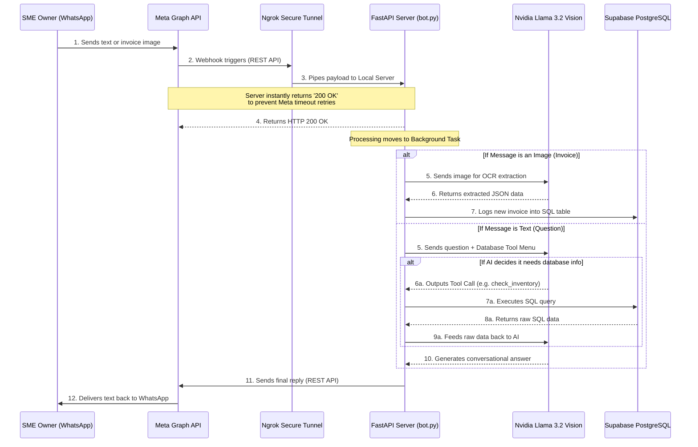

# FinCore AI Backend Architecture

```mermaid
sequenceDiagram
    participant User as SME Owner (WhatsApp)
    participant Meta as Meta Graph API
    participant Ngrok as Ngrok Secure Tunnel
    participant FastAPI as FastAPI Server (bot.py)
    participant AI as Nvidia Llama 3.2 Vision
    participant DB as Supabase PostgreSQL

    User->>Meta: 1. Sends text or invoice image
    Meta->>Ngrok: 2. Webhook triggers (REST API)
    Ngrok->>FastAPI: 3. Pipes payload to Local Server
    
    Note over FastAPI,Meta: Server instantly returns '200 OK'<br/>to prevent Meta timeout retries
    FastAPI-->>Meta: 4. Returns HTTP 200 OK
    
    Note over FastAPI: Processing moves to Background Task
    
    alt If Message is an Image (Invoice)
        FastAPI->>AI: 5. Sends image for OCR extraction
        AI-->>FastAPI: 6. Returns extracted JSON data
        FastAPI->>DB: 7. Logs new invoice into SQL table
    else If Message is Text (Question)
        FastAPI->>AI: 5. Sends question + Database Tool Menu
        
        alt If AI decides it needs database info
            AI-->>FastAPI: 6a. Outputs Tool Call (e.g. check_inventory)
            FastAPI->>DB: 7a. Executes SQL query
            DB-->>FastAPI: 8a. Returns raw SQL data
            FastAPI->>AI: 9a. Feeds raw data back to AI
        end
        
        AI-->>FastAPI: 10. Generates conversational answer
    end

    FastAPI->>Meta: 11. Sends final reply (REST API)
    Meta->>User: 12. Delivers text back to WhatsApp
```
