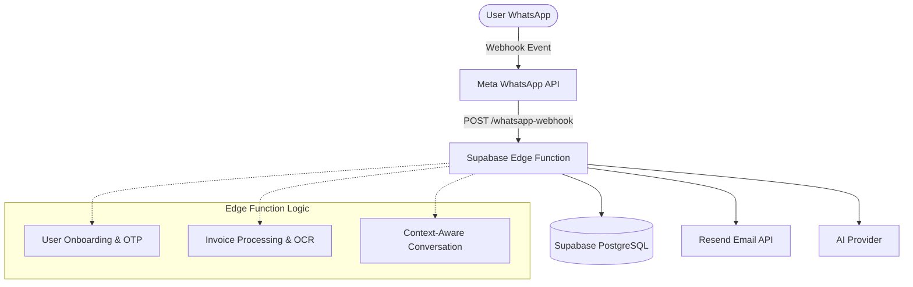
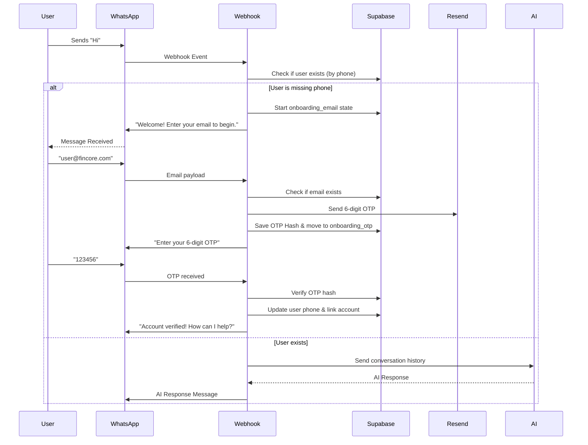

# FinCore WhatsApp AI Bot

FinCore WhatsApp AI Bot is an intelligent conversational agent built on Supabase Edge Functions and the Meta WhatsApp Cloud API. It interacts with users, handles secure authentication via email OTPs, processes invoices, queries transactions, and performs context-aware financial tasks using AI.

## Architecture



## User Onboarding Flow



## Setup & Deployment

1. Set up a Supabase Project.
2. Provide the following environment variables in your `.env` file:
   - `WHATSAPP_VERIFY_TOKEN`
   - `WHATSAPP_ACCESS_TOKEN`
   - `WHATSAPP_PHONE_NUMBER_ID`
   - `WHATSAPP_APP_SECRET`
   - `RESEND_API_KEY`
   - `ENTER_AI_API_KEY`
3. Deploy the Edge Function:
   ```bash
   npx supabase secrets set --env-file .env
   npx supabase functions deploy whatsapp-webhook
   ```
4. Push database migrations and seed data:
   ```bash
   npx supabase db push
   ```
5. Configure the Meta App Dashboard Webhook to point to the Supabase Edge Function URL.
